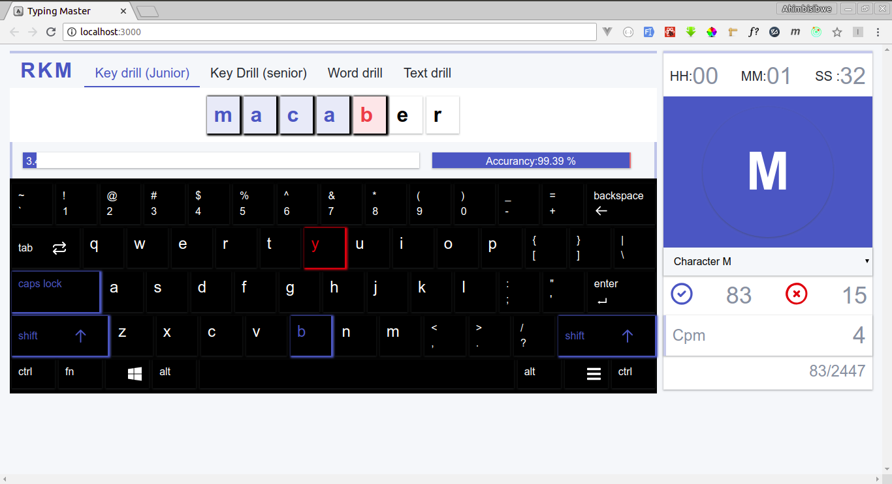

# Keyboard Typing Master [Demo](https://krmroland.github.io/typing-master/)

A keyboard typing app made with [React](https://reactjs.org/) and [Redux](https://redux.js.org/) with [Immutable](https://facebook.github.io/immutable-js/) for state management



# Getting Started

1.  You need to have [NodeJs](https://nodejs.org/en/) with npm or yarn.
2.  [Download ZIP](https://github.com/krmroland/typing-master.git) or git Clone https://github.com/krmroland/typing-master.git

3.  Install npm dependencies

```sh
npm install or yarn
```

# Building the project and start local web server

1.  Compiling the project

```
npm run start or yarn start
```

2 .Open the url in the browser [http://localhost:3000](http://localhost:3000).
